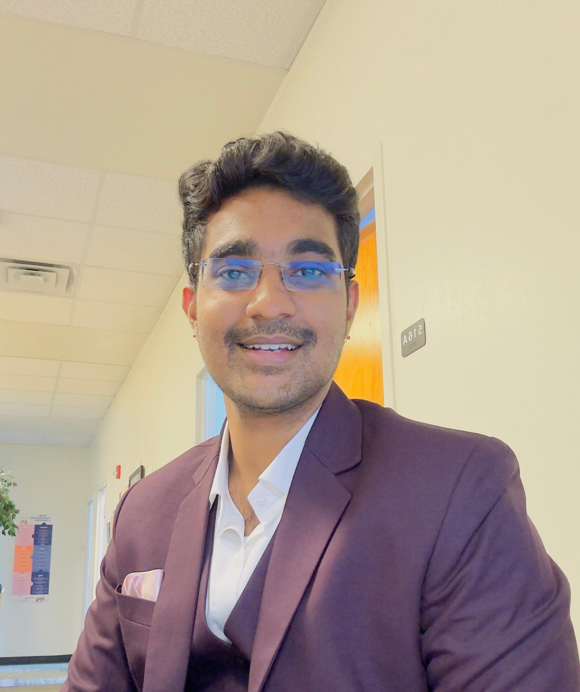

# About

  

  

    
Hello! I'm <strong>Abhijit Challapalli</strong>, a PhD student at <strong>The University of Texas at Arlington</strong>.
    I actively research and learn about Probabilistic Models and Diffusion Models. I also love to study and teach mathematics, especially its concepts in the fields of machine learning and deep learning.</strong>.

  

- **Research Interests**: Probabilistic Models, Diffusion Models, Machine Learning  

